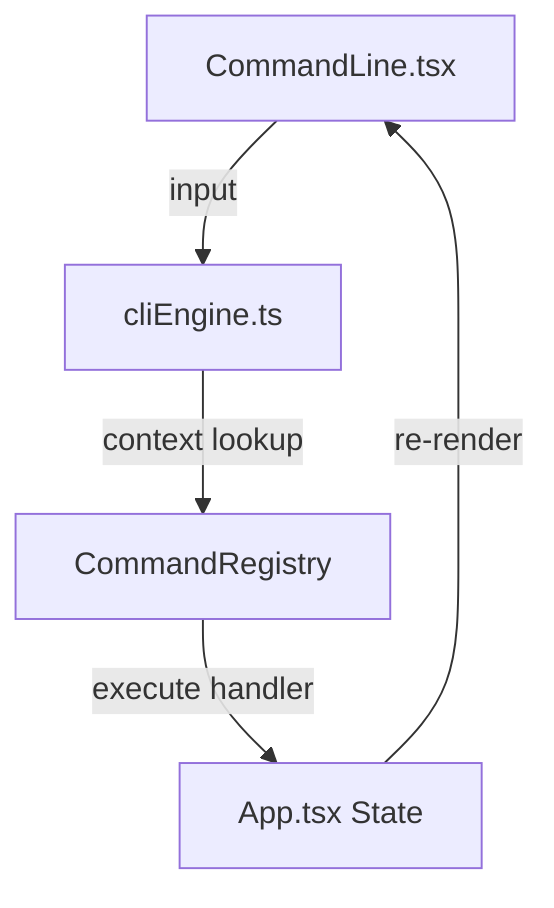

# ⌨️ Guia da Interface de Linha de Comando (CLI)

O LogicGateSim_Web implementa uma engine potente de comandos para manipulação rápida de componentes através de uma barra de texto na parte inferior do simulador. 

A CLI é impulsionada por um sistema **Context-Aware** guiado por um **Schema Declarativo** (`objectSchema.ts`) que fornece sugestões dinâmicas (IntelliSense) com base no estado atual do circuito e valida as propriedades permitidas para cada componente.

---

## 🛠️ Comandos Disponíveis

### `ADD [Tipo] [Inputs?]`
Adiciona uma nova porta ou objeto no centro da visão da câmera. 
- **Aliases Suportados:**
  - `SW` → Switch/Interruptor
  - `LED` → Lâmpada de Saída
  - `CLK` → Gerador de Clock
  - `DER` → Nó de Derivação
- **Exemplo:** `ADD OR 4` cria um portão OR com 4 entradas.

### `EDIT [Tipo] [ID] [Propriedade] [Valor]`
Modifica atributos de uma peça específica instalada no circuito. 
- **Seleção por ID:** O segundo argumento deve ser os primeiros 4 caracteres do ID do objeto (ex: `wzbf`). 
- **Propriedades:** `INPUTS` (número de entradas) e `COLOR` (nomes como `RED`, `BLUE`, ou códigos `#HEX`).
- **Exemplo:** `EDIT AND wzbf COLOR BLUE`

### `DEL [Tipo] [ID]`
Remove instantaneamente o objeto indicado pelo ID e corta todos os fios conectados a ele.
- **Exemplo:** `DEL XOR wzbf`

### `SAVE [Nome?]`
Faz o download de um arquivo JSON contendo o estado atual do circuito. Você pode fornecer um nome opcional para o arquivo.
- **Exemplo:** `SAVE meu_circuito` (Gera `meu_circuito.json`).

### `LOAD`
Abre uma janela no sistema operacional para selecionar e carregar um projeto em JSON, substituindo o circuito atual.
- **Exemplo:** `LOAD`

---

## 🧠 IntelliSense e Navegação

A barra de comandos possui um sistema de auxílio visual (Dropdown) que nasce acima da barra de input:

1. **Auto-Sugestão:** Ao digitar as iniciais de um comando ou argumento, o seletor mostrará as opções válidas.
2. **Navegação com Setas:** Use `Seta para Cima` e `Seta para Baixo` para navegar pela lista de sugestões.
3. **Auto-Complete:** Pressione `TAB` para preencher o input com o valor selecionado e pular para o próximo argumento.
4. **Destaque Visual (Glow):** Ao navegar por IDs de componentes (ex: `wzbf`), o objeto correspondente no circuito brilhará imediatamente em **Cyan** no Canvas para facilitar sua identificação antes de qualquer ação.

---

## 🏗️ Arquitetura (Engine)

O componente core `services/cliEngine.ts` opera de forma desacoplada do Ciclo de Renderização do React para garantir performance (60 FPS) enquanto você digita.

### Injeção de Contexto
Ao contrário de parsers genéricos de texto, o `cliEngine.getSuggestions` recebe o array `nodes` do circuito em tempo real. Isso permite que o autocomplete saiba exatamente quais IDs existem no mapa para sugerir enquanto você digita `EDIT` ou `DEL`.
